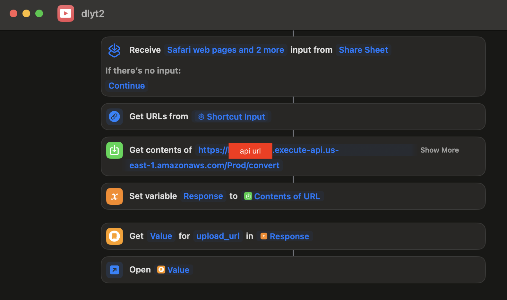

# ytwas

## Youtube downloader siri shortcut using aws lambda

- SAM CLI - [Install the SAM CLI](https://docs.aws.amazon.com/serverless-application-model/latest/developerguide/serverless-sam-cli-install.html)
- [Python 3 installed](https://www.python.org/downloads/)

## Build

To build and deploy your application for the first time, run the following in your shell:

```bash
sam build
sam deploy --guided --stack-name ytwas
```

## Siri shortcut



- Replace api url from output after `sam deploy` which will look like this:

```
  API Gateway endpoint URL for Prod stage for ytwas function"

  https://[IMPORTANT PART OF API URL IS HERE].execute-api.us-east-1.amazonaws.com/Prod/convert/"
```

## Fetch, tail, and filter Lambda function logs

`NOTE`: This command works for all AWS Lambda functions; not just the ones you deploy using SAM.

```bash
ytwas$ sam logs -n YtwasFunction --stack-name ytwas --tail
```

You can find more information and examples about filtering Lambda function logs in the [SAM CLI Documentation](https://docs.aws.amazon.com/serverless-application-model/latest/developerguide/serverless-sam-cli-logging.html).

## Cleanup

To delete the sample application that you created, use the AWS CLI. Assuming you used your project name for the stack name, you can run the following:

```bash
sam delete --stack-name ytwas
```

## Resources

See the [AWS SAM developer guide](https://docs.aws.amazon.com/serverless-application-model/latest/developerguide/what-is-sam.html) for an introduction to SAM specification, the SAM CLI, and serverless application concepts.

Next, you can use AWS Serverless Application Repository to deploy ready to use Apps that go beyond hello world samples and learn how authors developed their applications: [AWS Serverless Application Repository main page](https://aws.amazon.com/serverless/serverlessrepo/)
